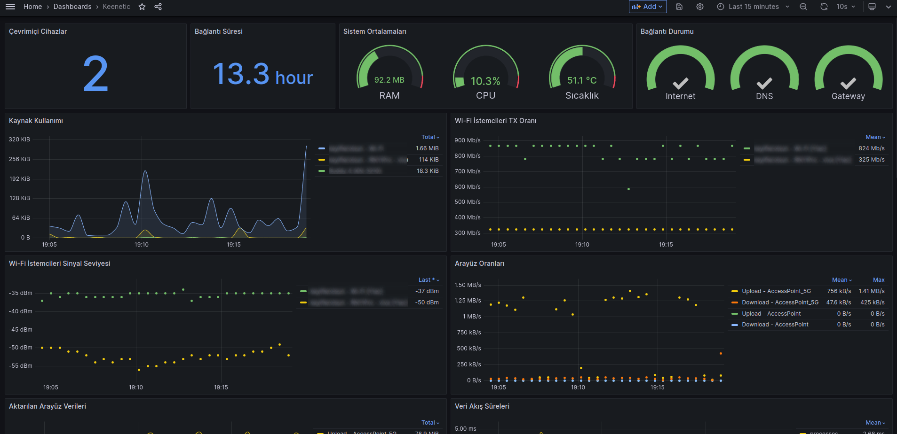

# Keenetic Grafana Monitör

[](#)

## Kurulum

1. `config/__config.ini` dosyasında keenetic arayüzünüzün kullanıcı adı ve şifresini belirtin.
  2. dosya adını `config.ini` olarak değiştirin.
3. `docker compose up -d --build` komutu ile konteynerleri başlatın.
4. Grafana Arayüzüne Giriş Yapın.

```txt
Grafana Arayüzü : http://127.0.0.1:3000
Grafana User    : admin
Grafana Pass    : admin
```

> [Home > Connections > Your connections > Data sources](http://127.0.0.1:3000/connections/your-connections/datasources)

5. Sekmesinden yeni bir `InfluxDB` veri kaynağı oluşturun. Girmeniz gereken değerler;

```txt
URL      : http://influxdb:8086
DATABASE : keenetic
USER     : merhaba
PASSWORD : dunya
```

> [Home > Dashboards > Import dashboard](http://127.0.0.1:3000/dashboard/import)

6. Sekmesinden `grafana-dashboard` **(TR veya EN)** `json` dosyasını `Import` edin ve `InfluxDB` kaynağını seçin.
